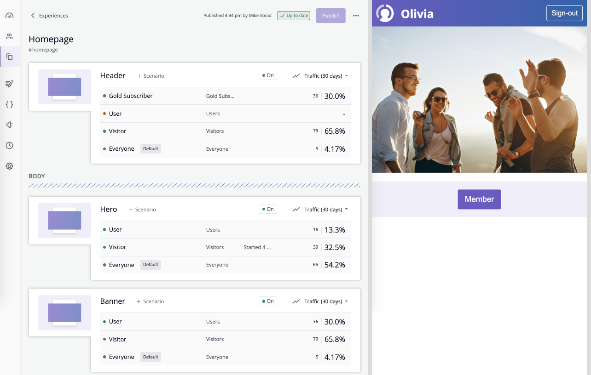

# mtribes samples - Browser

The sample projects below show how mtribes can be integrated with various browser based applications.
These samples demonstrate how to easily add targeting control into an existing app.

For background information see our [developer documentation](https://developers.mtribes.com/docs/sdk/getting-started).

## Samples

- [Angular](/angular) - a sample application demonstrating SDK integration with [Angular](https://angular.io).
- [React](/react) - a [React](https://reactjs.org) example using the mtribes SDK along with hooks from the sister mtribes React library.
- [Redom](/redom) - a bare-bones JavaScript example using the mtribes SDK with
  [RE:DOM](https://redom.js.org) for rendering.

### Running

First move into a sample project folder and install npm dependencies.

```
npm install
```

Now run the project in file watch mode.

```
npm run dev
```

You can then view the web app at http://localhost:1234

### Structure

Each sample contains the following files.

- `src/index_before.ts` - sample code before mtribes integration
- `src/index_after.ts` - sample code after mtribes integration
- `src/mtspace/sample/*` - generated mtribes Space integration code
- `index.html` - main entry point to app. Can be updated to point at
  `index_before.ts` or `index_after.ts`.

And the following UI elements.

1. `Header` - displays a sign-in/out button along with a welcome message when signed in
2. `Hero` - displays a targeted image depending on whether signed in or out
3. `Banner` - displays a targeted `Join Now` label when signed out, and a `Member` label when signed in

`Hero` and `Banner` are moved into an mtribes `Section` to highlight the dynamic scheduling
capabilities these can provide.

#### mtribes Space with sample app


